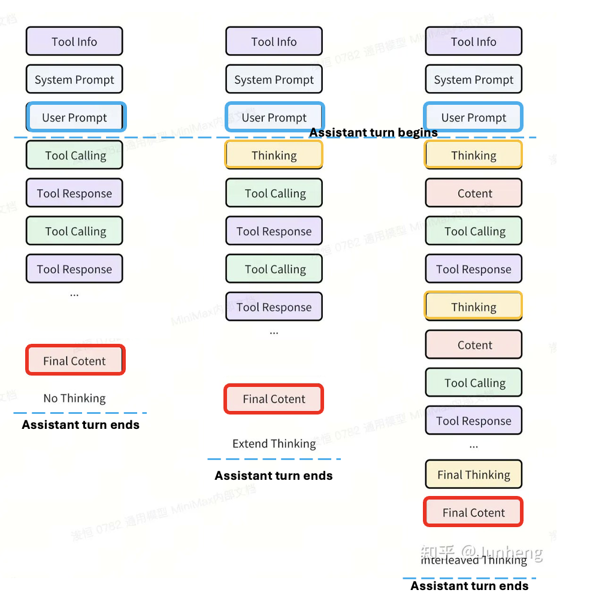
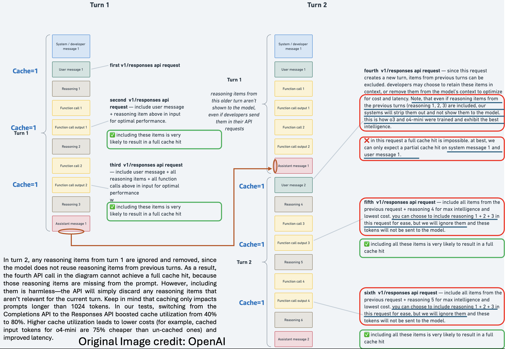

# interleaved-thinking: why & how?

Many API providers including OpenAI, Anthropic, MiniMax have implemented interleaved thinking/reasoning. That has created some confusion. It is a powerful technique. The person of this repository is to provide a clear understanding on this topic: including how to deal with these APIs to take advantage of the feature, and what are the impacts on caching.

One of the reasons that was given by Open AI for creating Response AI to succeed the Chat Completion API was that the former used to discard reasoning that could have been useful later.
This particularly matters for successive tool calls within the same assistant turn (until the assistant generates a response for user, the assistant turn is not considered over). 
Successive tool calls are not shown in this diagram, but next one.

# what is interleaved thinking, extended thinking anyways?

Below diagram from MiniMax team explains it succinctly.

# How to deal with reasoning block?

# Impact of Extended Thinking with Interleaved thinking for Tool calls?

OpenAI and Anthropic support caching. But MiniMax is yet to support caching - it is coming soon.

The APIs (OAI, Anthropic) automatically remove reasoning blocks from the previous turns. That behaviour can be best understood from the diagram below.
This can return in cache miss. Please read text on the diagram carefully.

Now Anthropic provides an option to retain the previous turn's reasoning blocks, so that cache is not invalidated. However, this has downside of filling up your context sooner.
So, no-free lunch. There is a trade off.

